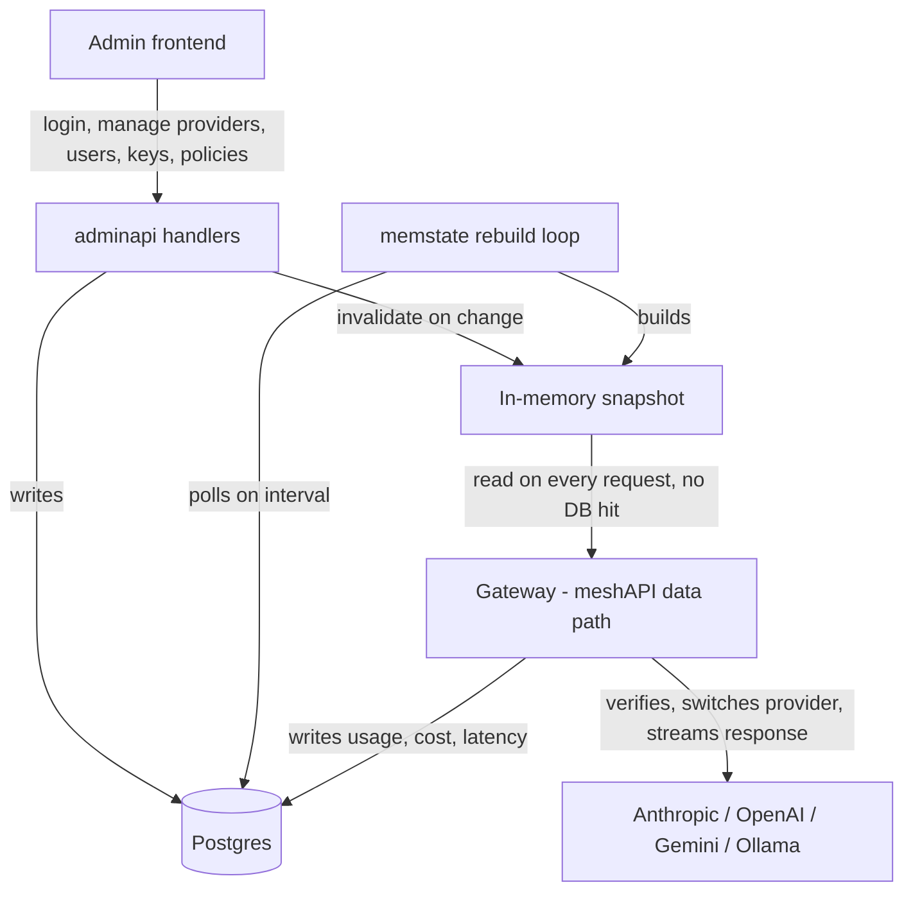

# Mesh

Mesh is a gateway plane for LLM providers. It sits between your product code and providers like Anthropic, OpenAI, Gemini, and Ollama, and gives every team, product, and key a single place to call through.

## How it works

Mesh is split into two planes.

**Data plane (meshAPI):** every actual model call goes through here. A request comes in on `/v1/proxy`, `/v1/generate`, or `/v1/embeddings`. Mesh resolves the calling key to a team, product, and model access grant, checks budget and rate limits, verifies the request against the configured provider connection, then switches it to the matching commercial provider (Anthropic, OpenAI, Gemini, Ollama, or anything speaking a compatible shape). The response is streamed straight back, and usage, cost, and latency are logged against the key that made the call. Nothing here talks to Postgres per request, it reads an in-memory snapshot, which is what keeps latency low.

**Control plane:** everything an admin does, managing providers, models, users, keys, budgets, and access policies. Changes here are the source of truth in Postgres, and get pulled into the in-memory snapshot the data plane reads from.



This gives you one endpoint and one request shape for every provider you allow, with per team, per product usage logs, without touching your application code.

## Who this is for

Built for small teams that want visibility into every provider call across teams and products, without running a heavy platform. Hyper lightweight, negligible infra cost, ultra low latency, since the gateway adds one hop and does not buffer full responses before streaming.

## Design priorities

Every decision in the gateway is weighed against two things: keep it the cheapest option to run, and keep it fast even under peak load. That is why the data plane reads from an in-memory snapshot instead of hitting Postgres per request, and why it stays a single lightweight instance instead of a heavier distributed setup.

## Limitations

- Runs as a single instance, no clustering or horizontal scaling yet.
- Backed by one database, no sharding or multi region support yet.
- Sized for small team workloads, not built for high volume multi tenant traffic.

## Project layout

- `server/` — the Go gateway and admin API. Both planes described above live here.
- `frontend/` — the Next.js admin panel, and the public `/docs` page.
- `caller/` — client SDKs for calling the data plane: a typed Python package, a typed TypeScript package, a single-file Python client, a single-file JS client, and a raw curl reference. All of them speak the same HTTP contract, pick whichever fits your stack.
- `testserve/` — a dummy upstream provider that impersonates Anthropic, OpenAI, Gemini, and Ollama on the wire. It lets you exercise every Mesh code path, template rendering, retries, timeouts, streaming, embeddings, generation, without calling a real commercial API or spending money. It also has scenario suffixes (`-slow`, `-hang`, `-flaky`, `-error-500`, and more) to simulate failure modes, and a `/_debug` API to inspect exactly what Mesh sent.

## Getting started

Install dependencies in `frontend/` and `server/`, then run:

```
make dev
```

This starts the frontend and the Go server together. Use `make dev-all` to also bring up `testserve` on port 9000 for local testing without hitting a real provider.

## Docs

Full API docs, setup steps, and SDK usage are at `/docs` once the server is running.

## License

Apache 2.0.
